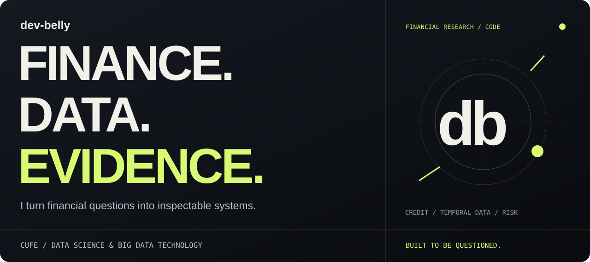
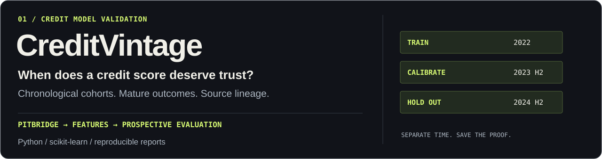
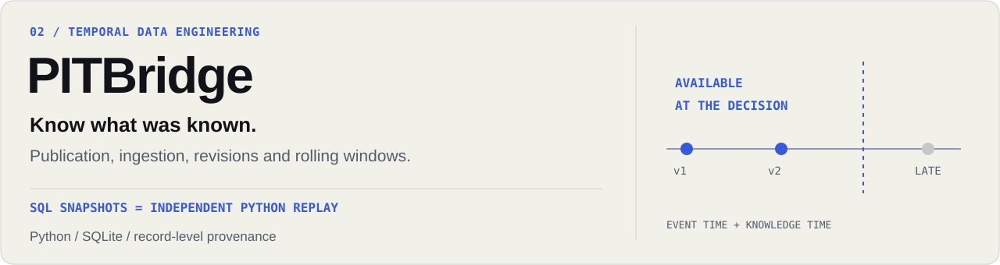
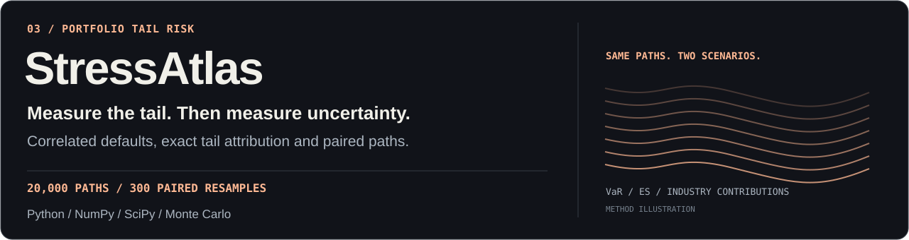

  
    
  <a href="#flagship-projects"><b>PROJECTS</b></a> &nbsp; / &nbsp;
  <a href="https://dev-belly.github.io/CreditVintage/lineage/"><b>LIVE DEMO</b></a> &nbsp; / &nbsp;
  <a href="#research-in-public"><b>RECENT WORK</b></a> &nbsp; / &nbsp;
  <a href="PROJECT_BRIEFS.md"><b>PROJECT NOTES</b></a>

 

I'm **dev-belly**, a Data Science & Big Data Technology student at **Central University of Finance and Economics**. I build tools for credit risk, financial data and quantitative research.

把金融问题拆成能运行、能检验、能追溯的系统。最近在做：**决策时点的数据、公开财报追溯、跨期信贷评估与网络风险**。

## Flagship projects

**01 · CreditVintage** — A credit score is only useful if its data and evaluation hold up.

训练、校准、测试分期隔离；标签等待完整表现期；同时展示原始与校准后的结果。新增 **PITBridge 联合案例**，从预测追到特征值、源记录、修订版本和可用时间。

[Source](https://github.com/dev-belly/CreditVintage) · [Risk report](https://dev-belly.github.io/CreditVintage/demo/) · [Source → prediction](https://dev-belly.github.io/CreditVintage/lineage/) · [Score monitor](https://dev-belly.github.io/CreditVintage/monitor/)

 

**02 · PITBridge** — Reconstruct what a decision could actually know.

同时考虑事件、发布、入库时间与历史修订；构造决策时点快照和 7/30 天滚动特征。每个聚合值都有源记录成员，SQLite 结果与独立 Python 实现逐项核对。

[Source](https://github.com/dev-belly/PITBridge) · [Snapshot counterexample](https://dev-belly.github.io/PITBridge/) · [Rolling features](https://dev-belly.github.io/PITBridge/rolling/) · [Walkthrough](https://github.com/dev-belly/PITBridge/blob/main/docs/INTERVIEW.md)

 

**03 · StressAtlas** — A tail estimate should come with its uncertainty.

用借款人层面的相关违约路径比较基准与压力情景；计算离散尾部 ES 和行业贡献；再用 300 次成对重采样检查 20,000 条路径下的估计精度。

[Source](https://github.com/dev-belly/StressAtlas) · [Stress report](https://dev-belly.github.io/StressAtlas/) · [Tail precision](https://dev-belly.github.io/StressAtlas/precision/) · [Walkthrough](https://github.com/dev-belly/StressAtlas/blob/main/docs/INTERVIEW.md)

Examples identify their public-filing or synthetic inputs. They demonstrate code and methodology; they do not establish live investment performance or real borrower risk.

## New projects

| Project | The engineering question | Inspect |
| :--- | :--- | :--- |
| [StatementTrace](https://github.com/dev-belly/StatementTrace) | Which publicly filed numbers were available at this cutoff, and which records produced each financial metric? | [Live report](https://dev-belly.github.io/StatementTrace/) · [SEC source ledger](https://github.com/dev-belly/StatementTrace/blob/main/docs/SOURCES.md) · [Walkthrough](https://github.com/dev-belly/StatementTrace/blob/main/docs/INTERVIEW.md) |
| [NetworkClear](https://github.com/dev-belly/NetworkClear) | Which institutions default after a counterparty shock, and can every cleared debt flow reconcile exactly? | [Live report](https://dev-belly.github.io/NetworkClear/) · [Clearing method](https://github.com/dev-belly/NetworkClear/blob/main/docs/METHODOLOGY.md) · [Walkthrough](https://github.com/dev-belly/NetworkClear/blob/main/docs/INTERVIEW.md) |

StatementTrace uses a **curated public Apple filing excerpt**; NetworkClear uses **synthetic exposures**. Both ship an offline CLI, inspectable CSV/JSON, source-backed methodology and semantic report replay.

## Research in public

| Shipped | Inspect the work |
| :--- | :--- |
| **2026-10-09 · Public statements, traceable metrics** | [StatementTrace #1](https://github.com/dev-belly/StatementTrace/pull/1): 33 curated SEC-filing records, exact fiscal periods, six cutoff panels, nine financial metrics and independent SQL selection checks. [Main CI + deployment](https://github.com/dev-belly/StatementTrace/actions/runs/37864981547). |
| **2026-10-09 · Counterparty clearing certificates** | [NetworkClear #1](https://github.com/dev-belly/NetworkClear/pull/1): 15 synthetic stress cases with rational payments, outside-loss reconciliation and independent exhaustive clearing checks. [Main CI + deployment](https://github.com/dev-belly/NetworkClear/actions/runs/37864984853). |
| **2026-10-09 · Price and cash costs** | [TradeForge cash-cost reconciliation](https://github.com/dev-belly/TradeForge/pull/10): fees and rebates reach total shortfall, attribution, Parquet and SQL; [public CLI checks](https://github.com/dev-belly/TradeForge/pull/11) keep the quoted demo and report consistent with actual output. |
| **2026-10-08 · Cancel before replacing** | [TradeForge order lifecycle repair](https://github.com/dev-belly/TradeForge/pull/9): cancel children still in transit before submitting the terminal sweep, so a 100-unit parent cannot become a 150-unit execution through duplicate fills. |
| **2026-10-08 · Download, extract, replay** | [CreditVintage evidence download](https://github.com/dev-belly/CreditVintage/pull/7): local and published explorers provide the same fixed 19-file ZIP; earlier evidence keeps its original page verification and model replay. |
| **2026-10-08 · Execution window boundaries** | [TradeForge execution-window repair](https://github.com/dev-belly/TradeForge/pull/7): replay earlier events to rebuild the book without leaking warm-up volume, freeze benchmarks at the deadline, and use later prices only to measure markouts. [Six passing CI jobs](https://github.com/dev-belly/TradeForge/actions/runs/37712196848). |
| **2026-10-08 · Costs across partial fills** | [TradeForge fee model](https://github.com/dev-belly/TradeForge/pull/4): charge one broker minimum per child order, preserve exact venue fees and rebates, and reject invalid fee assumptions before execution. |
| **2026-10-06 · One reference, end to end** | [CreditVintage integration update](https://github.com/dev-belly/CreditVintage/pull/6): the adapter, CI and public report build use the repaired PITBridge revision; saved inputs and predictions replay unchanged. |
| **2026-10-04 · Evidence you can open** | [Online lineage explorer](https://dev-belly.github.io/CreditVintage/lineage/) and [complete example ZIP](https://dev-belly.github.io/CreditVintage/lineage/evidence.zip): generated from source and verified before publication. |
| **2026-10 · Sources meet the model** | [CreditVintage × PITBridge](https://dev-belly.github.io/CreditVintage/lineage/): checked feature contracts, original event records, end-to-end replay and a browser explorer. |
| **2026-10 · Revision-safe cash-flow windows** | [PITBridge rolling features](https://github.com/dev-belly/PITBridge/pull/2): select eligible revisions before aggregation; preserve every contributing record. |
| **2026-10 · Precision of portfolio tails** | [StressAtlas paired bootstrap](https://github.com/dev-belly/StressAtlas/pull/2): resample complete simulation paths together; recompute absolute and incremental VaR/ES. |

**2026-10-09 · [Latest validation](PROJECT_REVIEW.md#recent-validation).** Credit evidence replays from sources to model predictions. TradeForge now separates price-only benchmarks from fee-inclusive shortfall and keeps its quoted tables aligned with the CLI; the full local check passed 859 tests, with 152 compiled/optional cases skipped. Fixed CI runs document each published repair.

## More builds

| Project | The engineering question |
| :--- | :--- |
| [AlphaForge](https://github.com/dev-belly/alphaforge) | Do factor signals survive walk-forward validation, portfolio constraints and costs? [Computed run ↗](https://dev-belly.github.io/alphaforge/sample-run/) |
| [TradeForge](https://github.com/dev-belly/TradeForge) | Can C++ execution events agree with an independent Python reference? [60-second tour ↗](https://github.com/dev-belly/TradeForge#sixty-second-tour) |
| [AuditLens](https://github.com/dev-belly/AuditLens) | Can an anomaly become an explainable review item? [Workpapers ↗](https://github.com/dev-belly/AuditLens/tree/main/outputs/reports) |
| [ControlTrace](https://github.com/dev-belly/ControlTrace) | Can an IT control finding be traced to the original evidence? [Case study ↗](https://github.com/dev-belly/ControlTrace/blob/main/docs/CASE_STUDY.md) |
| [LedgerX](https://github.com/dev-belly/LedgerX) | Can trading fills, accounting and portfolio marks reconcile exactly? [Valuation example ↗](https://github.com/dev-belly/LedgerX/blob/main/examples/valuation.json) |

<b>Experiments & earlier work</b>

 

| Experiment | What it explores |
| :--- | :--- |
| [Investor Network GNN](https://github.com/dev-belly/investor-network-gnn) | Graph ablations and [three-seed saved predictions](https://github.com/dev-belly/investor-network-gnn/tree/main/experiments/2026-09-17). |
| [High-dimensional Causal Allocation Lab](https://github.com/dev-belly/highdim-causal-allocation-lab) | Simulated causal estimation and robust allocation; [interactive example](https://dev-belly.github.io/highdim-causal-allocation-lab/). |
| [Interval Financial Risk](https://github.com/dev-belly/interval-financial-risk) | A [retained negative result](https://dev-belly.github.io/interval-financial-risk/): distributional features reduced AUC in this synthetic experiment. |
| [FactorLab](https://github.com/dev-belly/ashare-multifactor-research) | A-share factor evaluation and purged validation; [中文文档](https://github.com/dev-belly/ashare-multifactor-research/blob/main/README.zh-CN.md). |
| [WeCom Agent Platform](https://github.com/dev-belly/wecom-agent-platform) | Document retrieval and query workflows. |
| [Personal AI Chat](https://github.com/dev-belly/personal-ai-chat) | Local chat plus a separately configured private model connection. |

Earlier builds: [Digital Craftsman](https://github.com/dev-belly/digital-craftsman) · [Ranxin](https://github.com/dev-belly/ranxin-mini-program) · [Goose Leg Auntie](https://github.com/dev-belly/goose-leg-auntie-site).

---

[Project evidence](PROJECT_BRIEFS.md) · [Portfolio review](PROJECT_REVIEW.md) · [Design references](PROFILE_REFERENCES.md) · [Profile CI](https://github.com/dev-belly/dev-belly/actions/workflows/ci.yml)

Financial questions. Runnable code. Evidence you can inspect.
