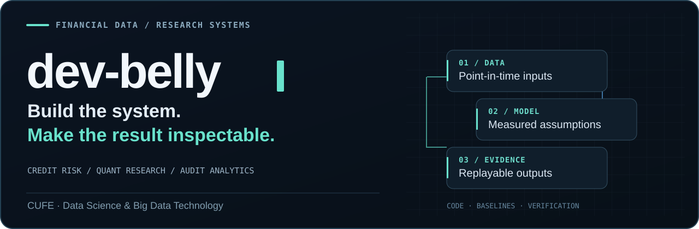
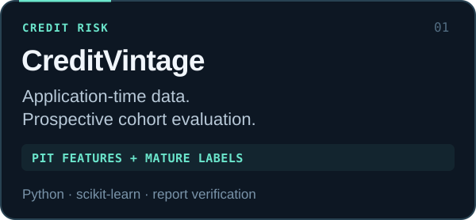
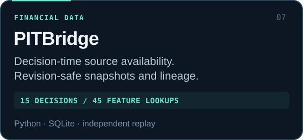
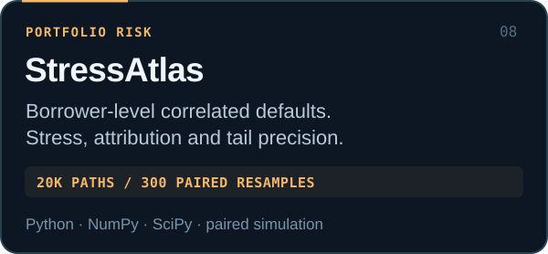
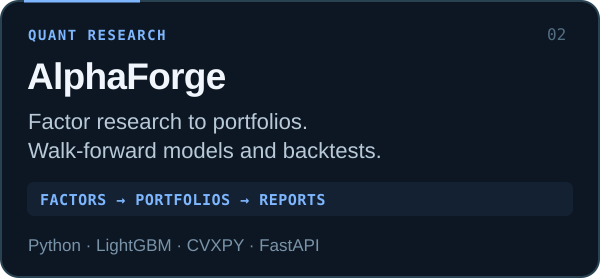
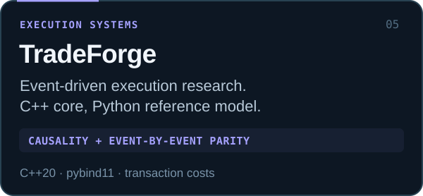
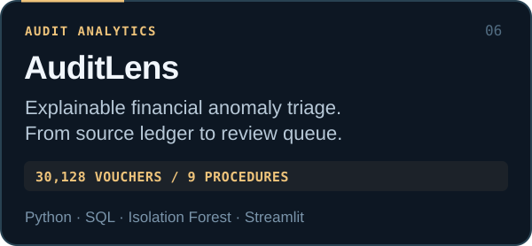
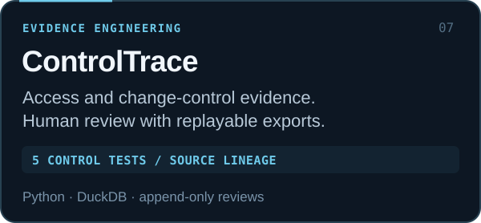
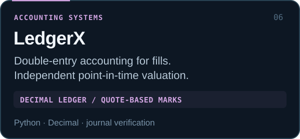

  

   

  <b>CUFE · Data Science & Big Data Technology</b> 
  金融数据工程 · 信贷风控 · 量化研究

    

  <a href="#selected-work"><b>Explore projects</b></a> &nbsp; / &nbsp;
  <a href="#live-research-desk"><b>Open reports</b></a> &nbsp; / &nbsp;
  <a href="PROJECT_BRIEFS.md"><b>Evidence & interview notes</b></a>

    

  

 

I build research systems around **data availability, measured assumptions, and reproducible results**. My projects connect the financial question to the data pipeline, model evaluation, and the evidence needed to inspect the answer.

关注金融数据分析、信贷风险与量化系统。希望每一个结果，都能追到数据来源、方法口径和可运行的代码。

## Selected work

<table>
<tr>
<td width="50%" valign="top">

 
<a href="https://github.com/dev-belly/CreditVintage"><b>Source</b></a> · <a href="https://dev-belly.github.io/CreditVintage/demo/">Risk report</a> · <a href="https://dev-belly.github.io/CreditVintage/monitor/">Score monitor</a>
</td>
<td width="50%" valign="top">

 
<a href="https://github.com/dev-belly/PITBridge"><b>Source</b></a> · <a href="https://github.com/dev-belly/PITBridge/blob/main/demo/snapshots.csv">Snapshot lineage</a> · <a href="https://github.com/dev-belly/PITBridge/blob/main/docs/INTERVIEW.md">Interview notes</a>
</td>
</tr>
<tr>
<td width="50%" valign="top">

 
<a href="https://github.com/dev-belly/StressAtlas"><b>Source</b></a> · <a href="https://github.com/dev-belly/StressAtlas/blob/main/docs/CASE_STUDY.md">Computed case</a> · <a href="https://github.com/dev-belly/StressAtlas/blob/main/demo/sector_es.csv">Tail attribution</a>
</td>
<td width="50%" valign="top">

 
<a href="https://github.com/dev-belly/alphaforge"><b>Source</b></a> · <a href="https://dev-belly.github.io/alphaforge/">Docs</a> · <a href="https://dev-belly.github.io/alphaforge/sample-run/">Computed example</a>
</td>
</tr>
<tr>
<td width="50%" valign="top">

 
<a href="https://github.com/dev-belly/TradeForge"><b>Source</b></a> · <a href="https://github.com/dev-belly/TradeForge#sixty-second-tour">Execution demo</a> · <a href="https://github.com/dev-belly/TradeForge#what-makes-the-numbers-defensible">Verification</a>
</td>
<td width="50%" valign="top">

 
<a href="https://github.com/dev-belly/AuditLens"><b>Source</b></a> · <a href="https://github.com/dev-belly/AuditLens#dashboard">Dashboard</a> · <a href="https://github.com/dev-belly/AuditLens/tree/main/outputs/reports">Workpapers</a>
</td>
</tr>
<tr>
<td width="50%" valign="top">

 
<a href="https://github.com/dev-belly/ControlTrace"><b>Source</b></a> · <a href="https://github.com/dev-belly/ControlTrace/blob/main/docs/CASE_STUDY.md">Case study</a> · <a href="https://github.com/dev-belly/ControlTrace/blob/main/docs/CONTROL_CATALOG.md">Control catalog</a>
</td>
<td width="50%" valign="top">

 
<a href="https://github.com/dev-belly/LedgerX"><b>Source</b></a> · <a href="https://github.com/dev-belly/LedgerX#point-in-time-portfolio-marks">Valuation model</a> · <a href="https://github.com/dev-belly/LedgerX/blob/main/examples/valuation.json">Example</a>
</td>
</tr>
</table>

**Financial examples use synthetic data.** They demonstrate the implemented workflow and its checks; their metrics do not establish live investment performance or real borrower risk.

## Live research desk

| Open | What to inspect |
| :--- | :--- |
| [CreditVintage · evaluation](https://dev-belly.github.io/CreditVintage/demo/) | Chronological cohorts, raw and calibrated probabilities, downloadable predictions and review capacity. |
| [CreditVintage · early monitor](https://dev-belly.github.io/CreditVintage/monitor/) | Score drift before current outcomes mature; reference bins and row-level evidence. |
| [AlphaForge · computed run](https://dev-belly.github.io/alphaforge/sample-run/) | The signal, execution timing, transaction-cost assumptions and backtest artifacts. |
| [Interval Financial Risk · experiment](https://dev-belly.github.io/interval-financial-risk/) | A retained negative result: distributional features reduced AUC in the synthetic experiment. |
| [FactorLab · A-share research](https://dev-belly.github.io/ashare-multifactor-research/) | Factor evaluation and purged validation; the default run is synthetic. |

## Engineering priorities

| Data | Evaluation | Evidence |
| :--- | :--- | :--- |
| Publication time, schema contracts, source lineage and explicit missingness. | Chronological splits, fixed baselines, separate calibration and measured costs. | Saved rows, deterministic replay, independent metric checks and CI. |

[Project evidence](PROJECT_BRIEFS.md) contains source-linked resume wording and interview questions. [Portfolio review](PROJECT_REVIEW.md) explains which projects to lead with for a role and which assumptions deserve a closer look.

<b>Research lab & other builds</b>

 

| Project | Focus |
| :--- | :--- |
| [Investor Network GNN](https://github.com/dev-belly/investor-network-gnn) | Saved predictions, graph ablations and a [three-seed benchmark](https://github.com/dev-belly/investor-network-gnn/tree/main/experiments/2026-09-17). |
| [High-dimensional Causal Allocation Lab](https://github.com/dev-belly/highdim-causal-allocation-lab) | Simulated covariate adjustment, causal estimation and robust allocation; [browser demo](https://dev-belly.github.io/highdim-causal-allocation-lab/). |
| [Interval Financial Risk](https://github.com/dev-belly/interval-financial-risk) | Expanding-window financial risk experiments with distributional features. |
| [FactorLab](https://github.com/dev-belly/ashare-multifactor-research) | A-share multi-factor research; [中文文档](https://github.com/dev-belly/ashare-multifactor-research/blob/main/README.zh-CN.md). |
| [WeCom Agent Platform](https://github.com/dev-belly/wecom-agent-platform) | Document retrieval and query workflows with a Python backend and React interface. |
| [Personal AI Chat](https://github.com/dev-belly/personal-ai-chat) | Local simulated chat and a separately configured private model connection. |

Earlier application work: [Digital Craftsman](https://github.com/dev-belly/digital-craftsman), [Ranxin](https://github.com/dev-belly/ranxin-mini-program), and the [Goose Leg Auntie case study](https://github.com/dev-belly/goose-leg-auntie-site).

---

Financial questions. Explicit assumptions. Inspectable systems.

